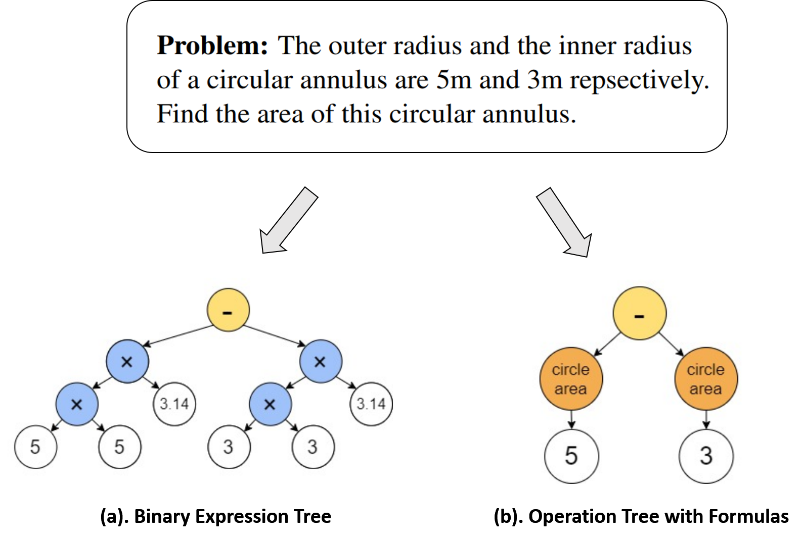

# Sequence to General Tree: Knowledge-Guided Geometry Word Problem Solving

This is the official repository for the ACL 2021 paper "Sequence to General Tree: Knowledge-Guided Geometry Word Problem Solving". In this paper, we introduce a **sequence-to-general-tree (S2G)** architecture which aims to generalize the previous sequence-to-tree models. Instead of mapping the problem text into a binary expression tree, our S2G can learn to map the problem text into an operation tree where the nodes can be formulas with arbitrary number of children (from unary to N-ary). In this way, we can incorporate domain knowledge (formulas) into problem-solving, making the results more neat and interpretable as well as improving the solver performance.




## Code and Data

We implement S2G using Pytorch and, in particular, `AllenNLP`. ,while the data can be found in `data/`


## Prerequisites

This project is written based on `AllenNLP` and `Pytorch Geometric` frameworks.

1. If you only want to run **S2G**, please install `AllenNLP` as follows:

```
pip install allennlp
```

2. If you want to run **S2G+KG**, please follow the instructions to install `Pytorch Geometric`  
https://github.com/rusty1s/pytorch_geometric


## Run S2G / S2G+KG

We provide

+ ``: run the configs in ....

```
bash run_.sh RESULT_DIR
```


## Evaluate

!python evaluate.py results/s2g-tune/check_loss/ --five_fold


